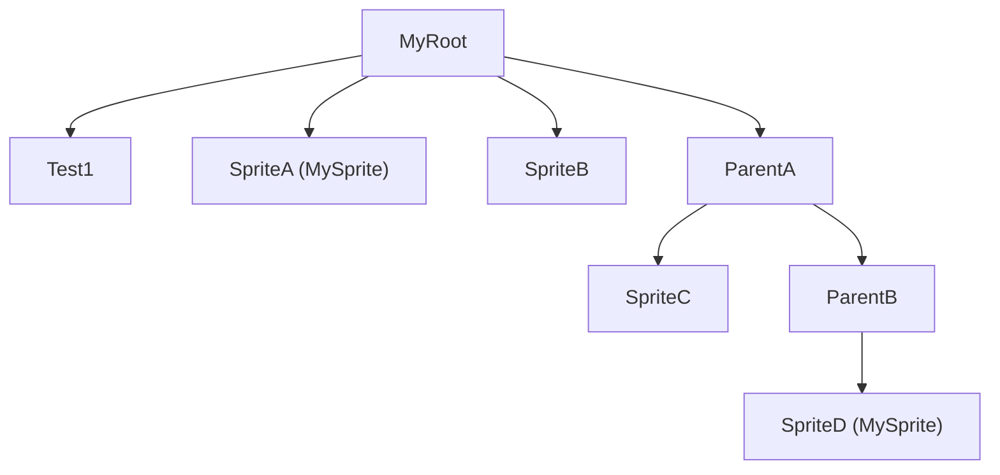

# godot_finder

Node finder addon for Godot 4.2.2 - 4.3

## Usage

- Example node tree:



- GDScript:

```gdscript
# get root node
var root = Finder.get_root()
print(root) # -> MyRoot

# query node by name, and get first one
var test1 = Finder.find_child_by_name(root, "Test1")
print(test1) # -> Test1

# query node by type, and get first one
var test_sprite1 = Finder.find_child_by_type(root, "Sprite2D")
print(test_sprite1) # -> SpriteA

# query node by type, and get all
var sprites = Finder.find_children_by_type(root, "Sprite2D")
print(sprites) # -> [SpriteA, SpriteB, SpriteC, SpriteD]

# query node by user defined type
var my_sprites = Finder.find_children_by_type(root, "MySprite")
print(my_sprites) # -> [SpriteA, SpriteD]

# query parent node by name
var parent1 = Finder.find_parent_by_name(test1, "MyRoot")
print(parent1) # -> MyRoot

# query parent node by type
var parent2 = Finder.find_parent_by_type(test1, "Node2D")
print(parent2) # -> MyRoot

# query parent nodes by type
var sprite_d = Finder.find_child_by_name(root, "SpriteD")
var parents = Finder.find_parents_by_type(sprite_d, "Node2D")
print(parents) # -> [ParentB, ParentA, MyRoot]
```

## Install

NOTE: [godot_finder_bin](https://github.com/funatsufumiya/godot_finder_bin) makes installation even easier.

### 1. Copy Files

- Create a `addons/finder` folder in your godot project
- Copy `*.gd`, `plugin.cfg`, `finder.gdextension` files from [`addons/finder`](project/addons/finder) to `addons/finder` in your godot project
- Create a `addons/finder/bin` folder in your godot project
- Place dll(s) from [Releases](https://github.com/funatsufumiya/godot_finder/releases) into `bin` folder


### 2. Enable Plugin

- Enable the plugin in the project settings

## Build and Run

(This process is needed only if you build this plugin by your own)

```bash
$ git submodule update --init --recursive --recommend-shallow --depth 1
$ scons
$ scons target=template_release
$ godot project/project.godot # (only first time)
$ godot --path project/ # run demo
```
